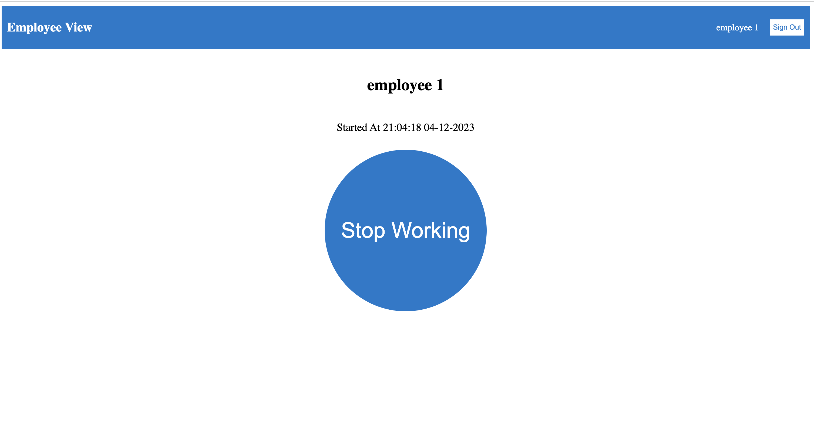

# Work-hour Tracker

## Abstract

This work-hour tracker application is a full-stack web solution designed to simplify employee time tracking and management. The application provides a seamless way for employees to log their work hours while enabling employers to monitor and review work time records.

The system operates through a role-based access control mechanism, offering two distinct interfaces: an Employee View and an Employer View. Employees can start and stop work sessions using an intuitive circular button interface, which automatically records the start and end times. The application calculates work duration in real-time and stores these records in a PostgreSQL database. Employees can also view their historical work hours through an interactive calendar interface.

Employers, on the other hand, have access to a comprehensive dashboard where they can select any employee from a dropdown menu and view their work hours displayed on a calendar. The calendar highlights days with logged work hours and shows the total hours worked per day, enabling efficient monitoring and management of employee time records.

The application is built using Next.js, which serves both as the frontend framework and backend API layer. Authentication and authorization are handled through Keycloak, ensuring secure access control. The entire system is containerized using Docker, making deployment and scaling straightforward. The application uses Prisma as an ORM to interact with the PostgreSQL database, providing type-safe database operations.

## Technologies

- Next.js - 13.4.19
- React - 18.2.0
- TypeScript - 5.2.2
- Node.js - 20.6.0
- PostgreSQL - 14.1
- Prisma - 5.3.1
- Keycloak - latest
- Next-Auth - 4.23.1
- Docker - 3.8
- Prettier - 3.0.3
- ESLint - 8.49.0
- date-fns - 2.30.0
- react-calendar - 4.6.1
- react-select - 5.7.7

## Installation

Follow this instruction to do the installation

https://drive.google.com/file/d/1sWBSV3iQPV6PL3gIuH7zzfSkq6KpJ_bf/view?usp=sharing

## User Manual

Follow this User manual to use the application

https://drive.google.com/file/d/1cDRR47d-yuXLbo3CjmHoTHKUe2hBCbgp/view?usp=sharing

## Project Structure

| **Folder**            | **Description**                       |
| --------------------- | ------------------------------------- |
| devops                | Docker compose and env files          |
| nextjs                | Front-end and back-end of the project |

## Course Information

This project was developed for LUT University's course: Full Stack Development
